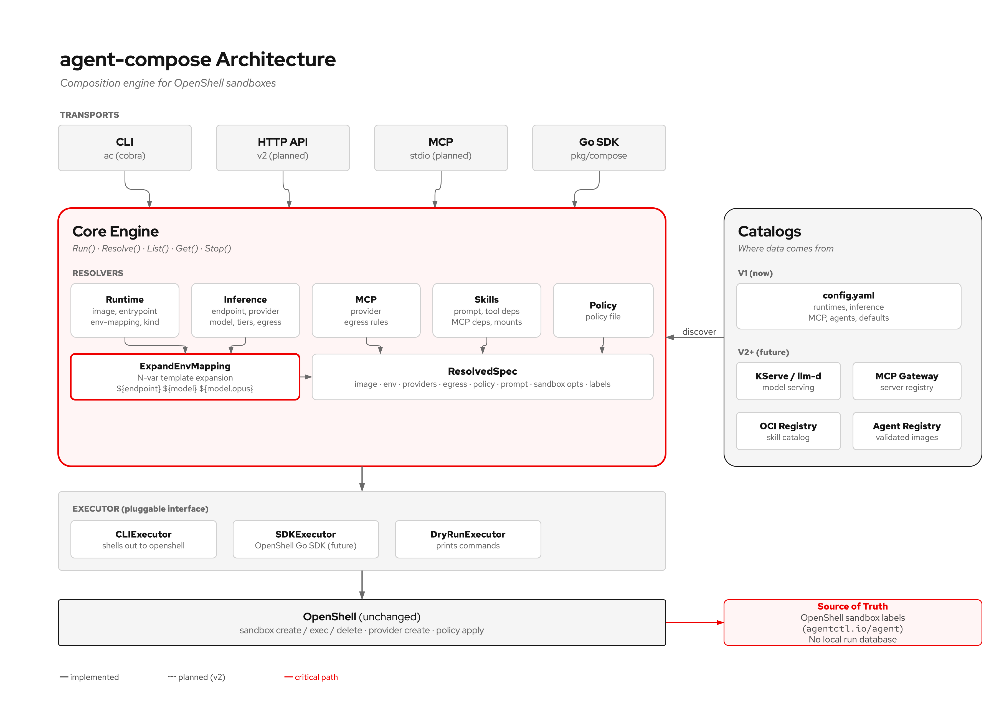

# agent-compose

Agent composition engine for OpenShell. Declare what an agent needs (runtime, model, MCP servers, skills, prompt); the engine resolves it into a running, governed sandbox. One command replaces 8 manual steps.



## Quick Start

```bash
make build

# Initialize: creates config + auto-detects local credentials (Vertex, GitHub, Anthropic)
ac init
#   Google Cloud ADC found       created vertex provider
#   GitHub token found           created github provider

# Validate your setup
ac doctor

# Compose an agent inline: runtime + inference + MCP servers + skills + prompt
ac run --runtime claude-code-vertex \
       --mcp github \
       --skills security-review \
       --prompt "Review this PR for vulnerabilities" \
       --workspace ./my-project \
       --dry-run

# Or use a named agent (same composition, declared in config.yaml)
ac run security-reviewer --workspace ./my-project

# Override the model for a single run
ac run security-reviewer --model llama-3.3-70b

# See exactly what was resolved (providers, env vars, assembled prompt, skill mounts)
ac get security-reviewer --json

# Lifecycle
ac list
ac stop security-reviewer
```

## How It Works

You define agents as compositions of five things:

```yaml
# ~/.ac/config.yaml
agents:
  security-reviewer:
    runtime: claude-code-vertex        # how to run it (image, entrypoint, providers)
    inference: vertex                   # which model (endpoint, default model, tiers)
    mcp: [github, jira]                # what tools it can access (credentials, egress)
    skills: [security-review]          # what instructions + references it gets
    prompt: "Review code for vulnerabilities."
```

`ac run security-reviewer` resolves this into:
- **Providers:** google-vertex-ai + github + jira (OpenShell handles credentials + egress)
- **Env vars:** ANTHROPIC_DEFAULT_SONNET_MODEL=claude-sonnet-4 (non-credential, from N-var mapping)
- **Prompt:** agent prompt + security-review skill prompt (assembled, deduped)
- **Skill mounts:** owasp-top-10.md uploaded into the sandbox
- **Sandbox opts:** scope=session, ttl=30m

Then calls `openshell sandbox create` with the right flags. The developer types one command; the engine handles the plumbing.

See [docs/composition.md](docs/composition.md) for the full walkthrough.

## Agent Types

| `runtime.kind` | Declaration | Examples |
|---|---|---|
| **harness** | `runtime: claude-code` | Claude Code, Codex, Goose |
| **framework** | `image:` + `env-mapping:` | ADK, LangGraph, CrewAI |
| **raw** | `image:` + `entrypoint:` | Any container |

## Commands

```
ac init                          Create config + auto-create providers from local credentials
ac run <name> [flags]            Resolve + create sandbox + start agent
ac stop <name>                   Stop agent + delete sandbox
ac list                          List running agents
ac get <name>                    Show fully resolved spec as JSON
ac logs <name>                   Stream sandbox output
ac apply --sync-profiles         Push provider profiles to OpenShell gateway
ac doctor                        Validate config and check environment readiness
```

**Run flags:** `--runtime`, `--inference`, `--model`, `--mcp`, `--skills`, `--prompt`, `--workspace`
**Global flags:** `--json`, `--dry-run`, `--config`, `--skills-dir`

## Documentation

| Doc | What it covers |
|---|---|
| [Composition Guide](docs/composition.md) | Full walkthrough: config, skills, MCP, named agents, resolution pipeline |
| [Running Agents](docs/running-agents.md) | Step-by-step examples: Claude Code, custom agents, ADK |
| [Architecture](docs/architecture.md) | Engine design, resolver interfaces, executor, Go SDK |
| [Personas and GitOps](docs/personas.md) | Developer, platform engineer, team lead workflows |
| [Test Results](docs/test-results.md) | End-to-end test evidence against live OpenShell gateways |
| [Upstream Issues](docs/upstream-issues/) | Validated OpenShell gaps with evidence and workarounds |

## Built-in Runtimes

| Runtime | Kind | OpenShell Provider | Key Env Vars |
|---|---|---|---|
| claude-code | harness | claude-code | ANTHROPIC_BASE_URL, ANTHROPIC_DEFAULT_SONNET_MODEL |
| claude-code-vertex | harness | google-vertex-ai | CLAUDE_CODE_USE_VERTEX, CLOUD_ML_REGION |
| codex | harness | codex | OPENAI_BASE_URL, OPENAI_MODEL |
| goose | harness | (none) | OPENAI_BASE_URL, GOOSE_MODEL |
| adk | framework | google-vertex-ai | GOOGLE_GENAI_MODEL |

Credentials are handled by OpenShell providers. Only non-credential env vars go through agent-compose.

## Development

```bash
make build          # Build binary
make test           # Run tests
go test ./examples/ # SDK examples
```
