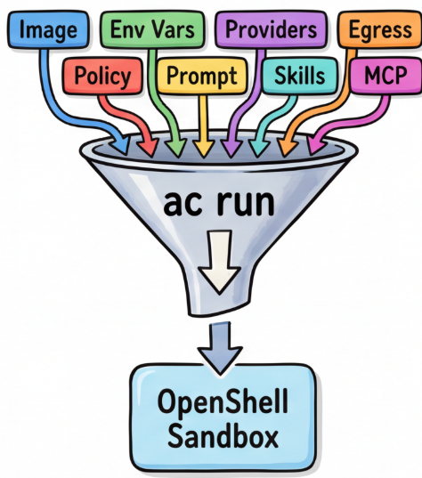

# agent-compose



Every AI agent needs the same things: a model, tools, credentials, a prompt, and a safe place to run. Today you wire those by hand: 8 steps, 3 configuration systems, different env var names per framework. Get one step wrong and the agent boots but can't do its job.

agent-compose fixes this. Declare what the agent needs; one command resolves it into a running, governed sandbox.

## Use Cases

**A developer wants to run a code reviewer.** They type `ac run code-reviewer --workspace ./repo`. The `--workspace` flag uploads the local directory into the sandbox so the agent can read and modify the code. The engine picks the right image, attaches the inference provider, connects the GitHub MCP server, injects the security review skill prompt, and creates the sandboxed environment. The developer doesn't configure any of this.

**A platform engineer supports 5 teams using different agents.** They write one `config.yaml` defining runtimes (Claude Code, Codex, ADK), inference endpoints (Vertex, MaaS, local vLLM), and MCP servers (GitHub, Jira, Slack). Each team defines their own agents by picking from this menu. The platform engineer runs `ac init` once; providers are auto-created from local credentials.

**A team lead standardizes how the team reviews code.** Instead of each developer configuring their own agent, the team lead defines `security-reviewer` in config: Claude Code as the runtime, GitHub and Jira as MCP servers, and a `security-review` skill (OWASP checklist + prompt instructions). Developers run `ac run security-reviewer --workspace ./repo` and get the same agent with the same tools and standards every time. Changes to the skill or prompt are reviewed in PRs like code.

**A CI pipeline runs headless agents.** `ac run test-runner --workspace ./repo --dry-run` produces the exact `openshell sandbox create` command with all flags. In production, `ac run test-runner` creates the sandbox, executes the agent, and returns the exit code.

**A dashboard backend resolves agent specs.** The Go library (`pkg/compose`) is imported directly. `engine.Resolve(ctx, "code-reviewer")` returns the full `ResolvedSpec` (image, env vars, providers, prompt, sandbox opts) as a struct. The dashboard previews the composition before the user clicks "Run."

Written in Go as a library-first design. The CLI (`ac`) is a thin wrapper. The same engine embeds into backend services, dashboard APIs, or platform controllers. When OpenShell ships a Go SDK, the executor swaps from CLI to native calls with zero API changes.

## Prerequisites

| What | Why | How to get it |
|---|---|---|
| **OpenShell gateway** | Runs sandboxes, enforces policy, manages providers | `helm install openshell oci://ghcr.io/nvidia/openshell/helm-chart` (cluster) or build from source (local podman) |
| **`openshell` CLI** | CLI interface to the gateway | `brew install openshell` or build from [NVIDIA/OpenShell](https://github.com/NVIDIA/OpenShell) |
| **Go 1.24+** | Build `ac` binary | `brew install go` |
| **Credentials** (at least one) | Authenticate agents to inference and tool providers | See below |

**Credential sources** (detected automatically by `ac init`):

| Credential | What it enables | How to set up |
|---|---|---|
| Google Cloud ADC | Claude Code via Vertex, ADK agents | `gcloud auth application-default login` |
| GitHub token | GitHub MCP access (PRs, repos, issues) | `gh auth login` |
| Anthropic API key | Claude Code via direct API | `export ANTHROPIC_API_KEY=sk-...` |

**Verify prerequisites:**

```bash
openshell status          # should show Connected
go version                # should show 1.24+
gcloud auth list          # should show an active account (for Vertex)
gh auth status            # should show logged in (for GitHub)
```

## Quick Start

```bash
make build

# Initialize: creates config + auto-detects local credentials
ac init
#   Google Cloud ADC found       created vertex provider
#   GitHub token found           created github provider

# Validate everything is wired up
ac doctor

# Compose an agent inline: runtime + MCP servers + skills + prompt
ac run --runtime claude-code-vertex \
       --mcp github \
       --skills security-review \
       --prompt "Review this PR for vulnerabilities" \
       --workspace ./my-project \
       --dry-run

# Or use a named agent (same composition, declared in config.yaml)
ac run security-reviewer --workspace ./my-project

# Override the model for a single run
ac run security-reviewer --model llama-3.3-70b

# See what was resolved (providers, env vars, assembled prompt, skill mounts)
ac get security-reviewer

# Lifecycle
ac list
ac stop security-reviewer
```

## How It Works

You define agents as compositions of five things:

```yaml
# ~/.ac/config.yaml
agents:
  security-reviewer:
    runtime: claude-code-vertex        # how to run it (image, entrypoint, providers)
    inference: vertex                   # which model (endpoint, default model, tiers)
    mcp: [github, jira]                # what tools it can access (credentials, egress)
    skills: [security-review]          # what instructions + references it gets
    prompt: "Review code for vulnerabilities."
```

`ac run security-reviewer` resolves this into:
- **Providers:** google-vertex-ai + github + jira (OpenShell handles credentials + egress)
- **Env vars:** ANTHROPIC_DEFAULT_SONNET_MODEL=claude-sonnet-4 (non-credential, from N-var mapping)
- **Prompt:** agent prompt + security-review skill prompt (assembled, deduped)
- **Skill mounts:** owasp-top-10.md uploaded into the sandbox
- **Sandbox opts:** scope=session, ttl=30m

Then calls `openshell sandbox create` with the right flags. The developer types one command; the engine handles the plumbing.

See [docs/composition.md](docs/composition.md) for the full walkthrough.

## Why Go

agent-compose is a Go library, not just a CLI tool. This matters for three reasons:

1. **Backend embedding.** The `pkg/compose` package can be imported into dashboard backends, operator controllers, or API servers. A console UI calls `engine.Resolve()` to show the user what an agent will look like before creating it, then `engine.Run()` to launch it. No shell subprocess needed.

2. **Cloud-native ecosystem.** Go is the lingua franca of the cloud-native stack. agent-compose integrates naturally with the tools teams already use. When OpenShell ships a Go SDK, the executor swaps from shelling out (`CLIExecutor`) to native Go calls (`SDKExecutor`) with zero API changes. The `Executor` interface is the seam.

3. **Single binary.** `ac` compiles to one binary with no runtime dependencies. Deploy it alongside `openshell` on any platform.

## Agent Types

| `runtime.kind` | Declaration | Examples |
|---|---|---|
| **harness** | `runtime: claude-code` | Claude Code, Codex, Goose |
| **framework** | `image:` + `env-mapping:` | ADK, LangGraph, CrewAI |
| **raw** | `image:` + `entrypoint:` | Any container |

## Commands

```
ac init                          Create config + auto-create providers from local credentials
ac run <name> [flags]            Resolve + create sandbox + start agent
ac stop <name>                   Stop agent + delete sandbox
ac list                          List running agents
ac get <name>                    Show fully resolved spec as JSON
ac logs <name>                   Stream sandbox output
ac apply --sync-profiles         Push provider profiles to OpenShell gateway
ac doctor                        Validate config and check environment readiness
```

**Run flags:** `--runtime`, `--inference`, `--model`, `--mcp`, `--skills`, `--prompt`, `--workspace`
**Global flags:** `--json`, `--dry-run`, `--config`, `--skills-dir`

## Documentation

| Doc | What it covers |
|---|---|
| [Tutorial](docs/tutorial.md) | Step-by-step: build, init, skills, MCP, inference, named agents, SDK |
| [Composition Guide](docs/composition.md) | Config, skills, MCP, named agents, resolution pipeline |
| [Running Agents](docs/running-agents.md) | Step-by-step examples: Claude Code, custom agents, ADK |
| [Architecture](docs/architecture.md) | Engine design, resolvers, executor, Go SDK |
| [Personas](docs/personas.md) | Who sets up what, prerequisites, handoff flow |
| [Test Results](docs/test-results.md) | Live test evidence against real OpenShell gateways |
| [Upstream Issues](docs/upstream-issues/) | Validated OpenShell gaps with workarounds |

## Built-in Runtimes

| Runtime | Kind | OpenShell Providers | Key Env Vars |
|---|---|---|---|
| claude-code | harness | claude-code | ANTHROPIC_BASE_URL, ANTHROPIC_DEFAULT_SONNET_MODEL |
| claude-code-vertex | harness | google-vertex-ai, google-cloud | CLAUDE_CODE_USE_VERTEX, CLOUD_ML_REGION |
| codex | harness | codex | OPENAI_BASE_URL, OPENAI_MODEL |
| goose | harness | (none) | OPENAI_BASE_URL, GOOSE_MODEL |

Credentials are handled by OpenShell providers. Only non-credential env vars go through agent-compose.

Framework and raw agents (ADK, LangGraph, custom containers) are defined in your config.yaml with a custom image and entrypoint. See [docs/composition.md](docs/composition.md).

## Development

```bash
make build          # Build binary
make test           # Run tests
go test ./examples/ # SDK examples
```
