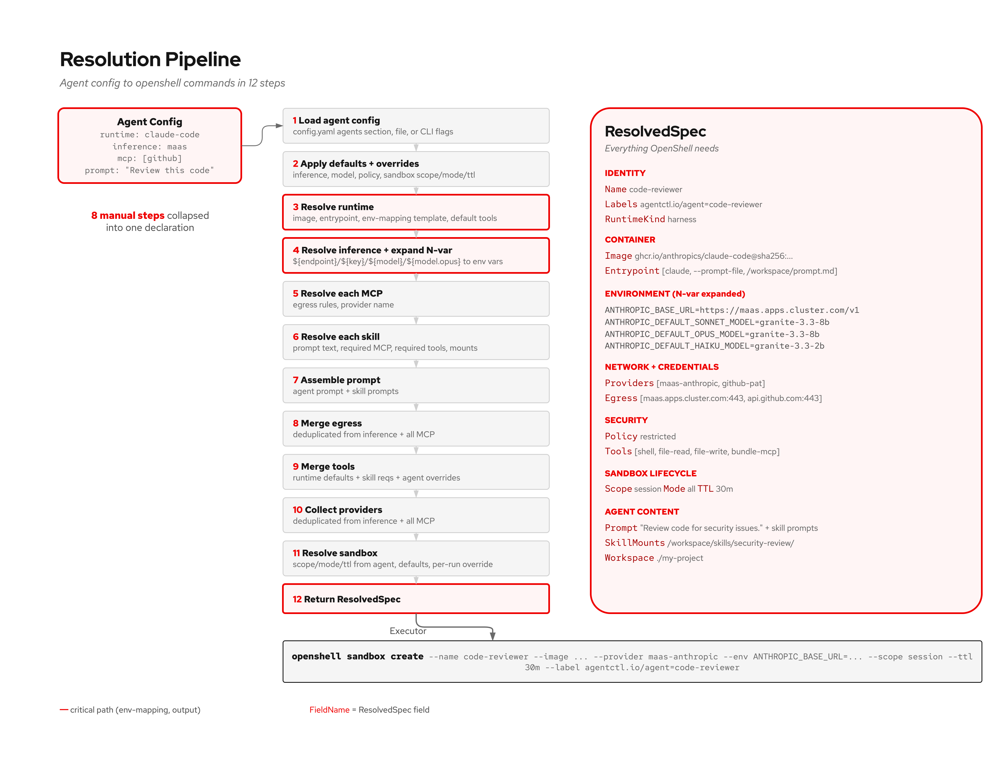

# Composing Agents

agent-compose resolves agent declarations into OpenShell sandbox commands. This guide walks through every composition feature.

## Config Structure

One file (`~/.ac/config.yaml`) with five sections:

```yaml
runtimes:     # how agents run (image, entrypoint, env-mapping, providers)
inference:    # where models are (endpoint, provider, default model, tiers)
mcp:          # what tools are available (provider, egress)
defaults:     # fallback values (inference, sandbox scope/mode/ttl)
agents:       # named compositions (runtime + inference + mcp + skills + prompt)
```

## Three Friction Tiers

**Zero files (CLI flags):**
```bash
ac run --runtime claude-code --inference maas --mcp github --prompt "Review this"
```

**Named agent (config entry):**
```yaml
agents:
  code-reviewer:
    runtime: claude-code
    inference: maas
    mcp: [github]
    skills: [security-review]
    prompt: "Review code for security issues."
```
```bash
ac run code-reviewer
```

**Separate files (GitOps):**
```
my-agents-repo/
+-- config.yaml
+-- agents/
+-- skills/
```

## Skills

Skills are reusable bundles of prompt instructions + tool/MCP dependencies + reference files.

```
~/.ac/skills/security-review/
+-- SKILL.md
+-- references/
    +-- owasp-top-10.md
```

SKILL.md can declare dependencies:
```markdown
---
requires:
  mcp: [github]
  tools: [shell, file-read]
---

# Security Review
When reviewing code, check for SQL injection, XSS, auth bypass...
```

When an agent references `skills: [security-review]`:
1. The skill's prompt is appended to the agent's prompt
2. `requires.mcp` is merged into the agent's MCP list (deduped)
3. `requires.tools` is merged into the tool allowlist
4. Reference files are uploaded into the sandbox via `--upload`

Skills compose: if two skills both require `github`, it's deduplicated.

## N-var Env-Mapping

Runtime profiles use template maps to handle any framework's env var conventions:

```yaml
runtimes:
  claude-code:
    env-mapping:
      ANTHROPIC_BASE_URL:             "${endpoint}"
      ANTHROPIC_DEFAULT_SONNET_MODEL: "${model}"
      ANTHROPIC_DEFAULT_OPUS_MODEL:   "${model.opus}"
      ANTHROPIC_DEFAULT_HAIKU_MODEL:  "${model.haiku}"
```

Inference providers define the values:
```yaml
inference:
  maas:
    endpoint: https://maas.apps.cluster.com/v1
    default-model: granite-3.3-8b-instruct
    models:
      opus: granite-3.3-8b-instruct
      haiku: granite-3.3-2b-instruct
```

Override at run time: `ac run code-reviewer --model llama-3.3-70b`

## OpenShell Provider Integration

Runtime profiles declare which OpenShell providers they need:
```yaml
runtimes:
  claude-code:
    providers: [claude-code]      # OpenShell handles credentials + egress
  claude-code-vertex:
    providers: [google-vertex-ai]
```

Credentials (API keys, tokens) are handled by OpenShell providers, not env vars. The engine only passes non-credential env vars (model names, endpoint overrides).

`ac init` auto-creates providers from local credentials (gcloud ADC, gh token, ANTHROPIC_API_KEY).

## Resolution Pipeline

The engine resolves agent configs in 12 steps:



```
 1. Load agent config (from config.yaml, file, or CLI flags)
 2. Apply defaults + per-run overrides (inference, model, sandbox)
 3. Resolve runtime     -> image, entrypoint, env-mapping, providers
 4. Resolve inference   -> expand N-var env-mapping -> env vars, provider
 5. Resolve each MCP    -> egress, provider
 6. Resolve each skill  -> prompt, required MCP (deduped), required tools
 7. Assemble prompt     -> agent prompt + skill prompts
 8. Merge egress        -> deduplicated from inference + all MCP
 9. Merge tools         -> runtime defaults + skill requirements + agent overrides
10. Collect providers   -> deduplicated from runtime + inference + all MCP
11. Resolve sandbox     -> scope/mode/ttl from agent, defaults, per-run override
12. Return ResolvedSpec
```

## Full Example

**Platform engineer configures infrastructure:**
```yaml
runtimes:
  claude-code:
    kind: harness
    image: ghcr.io/nvidia/openshell-community/sandboxes/base:latest
    env-mapping:
      ANTHROPIC_DEFAULT_SONNET_MODEL: "${model}"
    entrypoint: ["claude"]
    providers: [claude-code]

inference:
  maas:
    endpoint: https://maas.apps.cluster.com/v1
    provider: maas-anthropic
    default-model: granite-3.3-8b-instruct

mcp:
  github:
    provider: github
    egress: [api.github.com:443]
  jira:
    provider: jira
    egress: [redhat.atlassian.net:443]
```

**Team lead defines agents:**
```yaml
agents:
  pr-reviewer:
    runtime: claude-code
    mcp: [github, jira]
    skills: [pr-review, security-review]
    prompt: "Review PRs end-to-end. Check Jira for context."
```

**Developer runs:**
```bash
ac run pr-reviewer --workspace ./my-project
```

**What the engine resolves:**
- 4 providers: claude-code, maas-anthropic, github, jira
- 2 MCP servers merged (github + jira egress)
- 2 skills merged (prompts assembled, dependencies deduped)
- Skill reference files uploaded via --upload
- Model env var expanded
- Sandbox opts applied (scope=session, ttl=30m)
